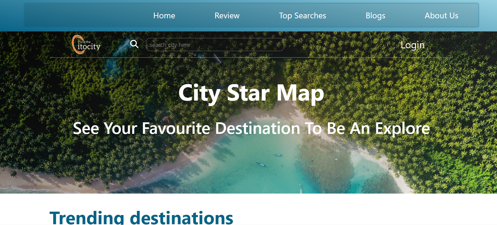

# City Star Map

## Introduction  
The CityStar Map Project is an interactive web application designed to help users discover cities and explore top famous places in India. This project provides detailed information about each city and its notable landmarks, making it an ideal resource for travelers and anyone interested in learning more about India's rich cultural heritage.

**Website URL : "https://github.com/sonaligadekar20/city-star-map"**

## Top Places In India

## Description
City Star Map is a web application built with React for searching cities and top famous places in India. When a user searches for a city or place, retrieve relevant information from your database.

## Features
**City Search :** Easily find cities in India by name, region, or other relevant criteria.

**Famous Places :** Discover top famous places within each city, complete with descriptions and images.

**Interactive Map :** Explore a map interface with markers pinpointing the locations of cities and landmarks.

### Real-Life Usefulness:
This website serves as a valuable resource for users to search about specific destinations.

## Contributors

Made with [contrib.rocks](https://contrib.rocks).

